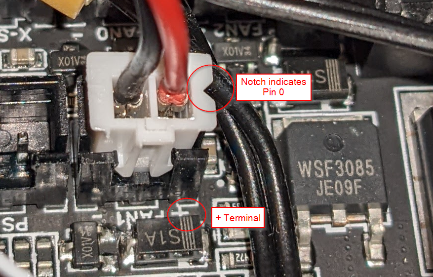
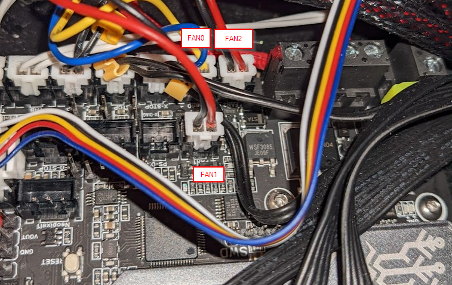

# Ender 3 SRK Mini E3 v3 upgrade notes

My notes on upgrading my Ender 3's to the SKR Mini E3 v3
Mine is configured to used the stock microswitch for homing Z, and the BLTouch for bed leveling.

## Todo

The hard stuff?

* gross z-offset calibration.
* E-Step calibration.
* fine z-offset calibration.

## Old motherboard removal

Not much to say here, other than ***take pictures of all the connections***.
Lots of hot glue was used on the stock Creality board.  I used a small knife and fine needle-nose pliers to remove it, and plenty of force.

* Take pictures of all the connections so you can see the polarity.
* If you want to save yourself a little time, check your current value for E-Steps.  You can use `M503` to output the current settings.  Write them down or save that output, it might be useful later.  I had only changed my E-Steps.

## Re-terminating the hotend fan

The hotend fan on my Ender 3 was bare wire, because it connected to screw terminals on the original Creality mainboard.
The correct connector is a 2-pin JST-XH plug.  I bought these: https://smile.amazon.com/gp/product/B01MCZE2HM

The positive wire (which was indeed red on my Ender 3) for the fan goes in pin 0 on the JST-XH.  

## BLtouch install

Not much to say here other than you don't have to get super fussy with the wire routing if you don't want to.

## New mainboard installation

Again nothing much here, the most notable things are the firmware defaults for the fans.

* FAN0 on the Mini is the part cooling fan by default.  My connector had blue and yellow wires.
* FAN2 on the Mini is the enclosure fan.  Red and black wires.
* FAN1 on the Mini is the part cooling fan.  Red and block wires.  See photo above.
* It does not matter which connector is used for the Z stepper.  
* Direct link to the SKR Mini E3 V3 connector diagram: <https://github.com/bigtreetech/BIGTREETECH-SKR-mini-E3/blob/master/hardware/BTT%20SKR%20MINI%20E3%20V3.0/Hardware/BTT%20E3%20SKR%20MINI%20V3.0_Top.pdf>

## Test steppers and enclosure fan

My SRK Mini E3 V3 shipped with a Marlin 2.0 bugfix firmware that is configured to *only* enable the enclosure fan when the steppers have been running, as the main source of heat for the mainboard is the stepper drivers.

Once you're ready to test the printer, power it up, and ***keep one hand hovering over the power switch***.

* Check that the enclosure fan is not running.  (It shouldn't be if you just powered on the printer.)
* Home the axes, making sure that nothing bad happens.  I was shocked at how quiet this was.
* Once homing is done, move the X, Y and Z axes via the menus, and ensure they move in the expected directions.
* Check that the enclosure fan is now running at 100% after moving the axes.
* If you disable the steppers and leave the printer alone for a bit, the enclosure fan will turn off.  I love this feature.

## Test the heated bed

* Set the bed temp to something that is warmer than ambient, and not hot enough to be dangerous, and verify that it does indeed heat and hold a temperature.

## Test the Hotend and Hotend Fan

* Set the hotend to 51 degrees c.  Watch as the hotend heats up, when the hotend hits 50, the hotend fan should come on at 100%.
* Set the hotend to 49 (or off), and watch the hotend fan turn off when the temperature falls below 50.

## Test the part cooling fan

Connect the mainboard to a computer (or Octoprint) you can use to send gcode commands.

* Use `M106` to set the part cooling fan to full speed.
* Use `M107` to stop it.

## Re-flash the firmware with BLTouch Support

* Direct link to firmware with bltouch support: https://github.com/bigtreetech/BIGTREETECH-SKR-mini-E3/blob/master/firmware/V3.0/Marlin/firmware-ender3-bltouch.bin
* Put this file in the root of an SD card, and rename it to `firmware.bin`.
* Power off the printer
* Inset the SD card
* Power on the printer and watch it flash (it's quick!)

## Zero the Z-probe offset to prevent bed scraping

In order to make sure your print head doesn't make a nice scrape along your printing surface, zero out the z-probe offset.  The default may be reasonable, so write it down if you want it for reference.

* It's the 2nd item under `Configuration`.

